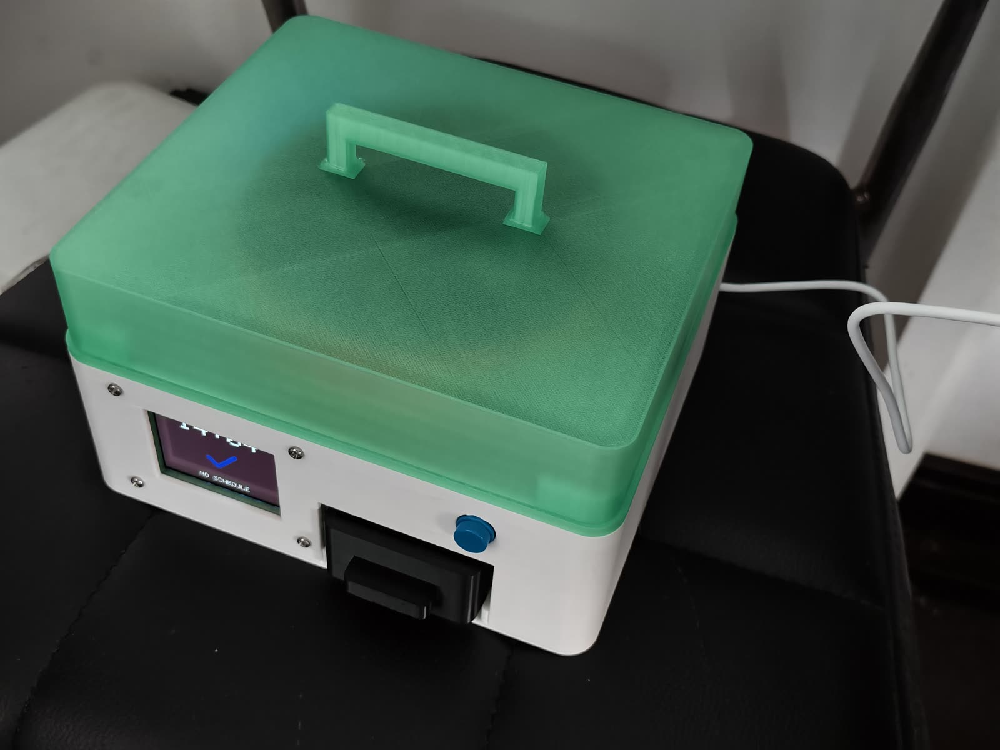
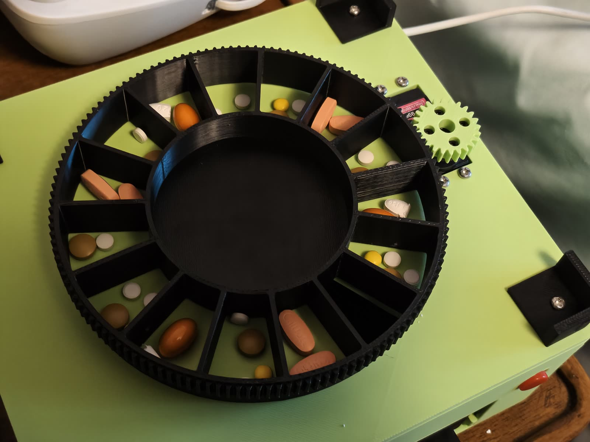
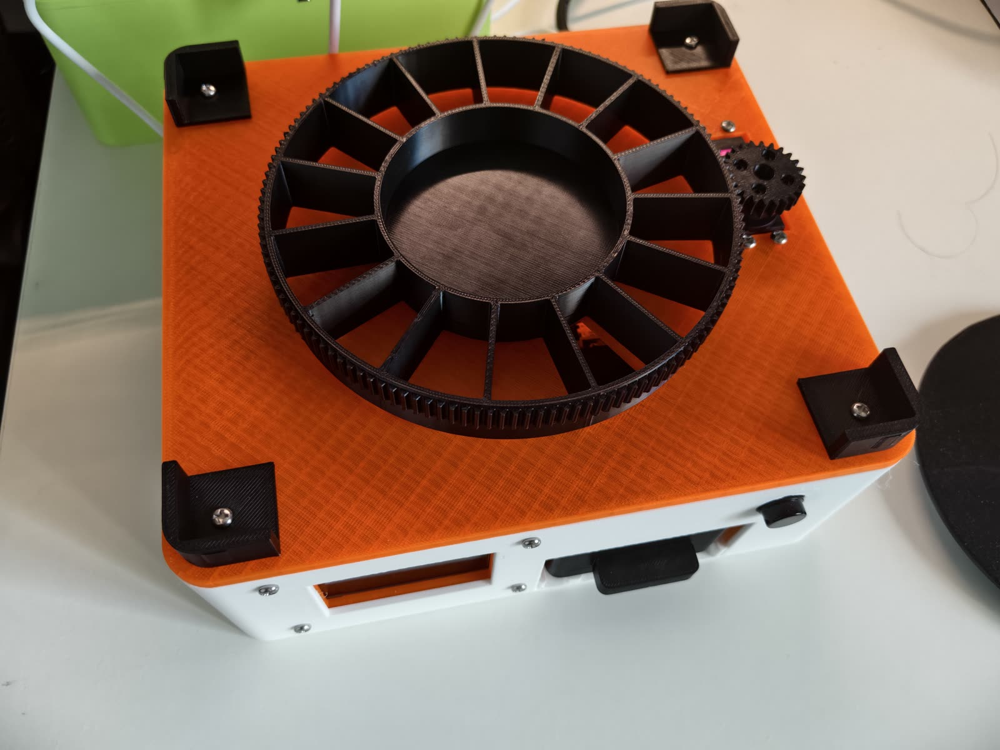
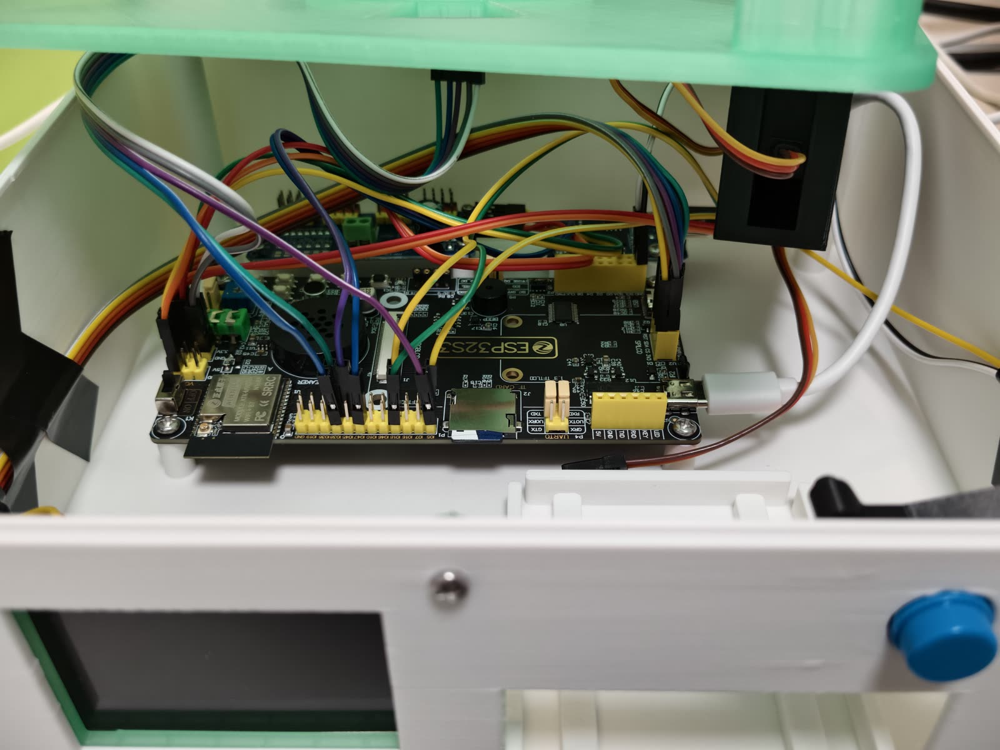
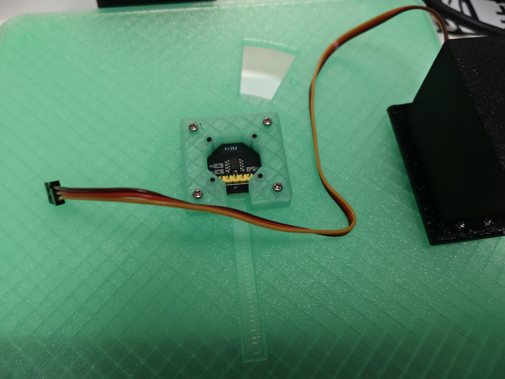
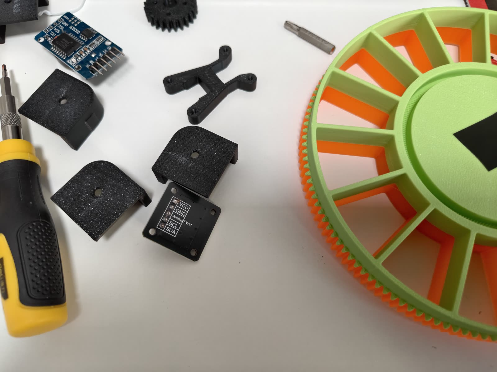
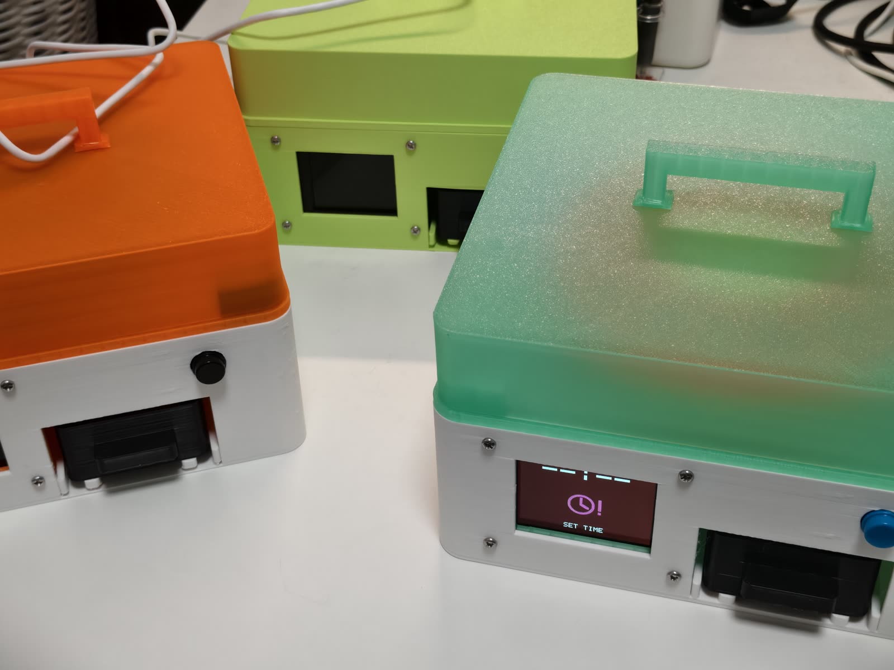

# Mendo 萌豆药盒

### A pill-dispenser prototype by EQ Studio



Mendo explores how a simple physical reminder, readable display and removable
medication tray can support a caregiver's routine. This repository documents
EQ Studio's single-layer, 15-compartment prototype and its development.

**Experimental prototype, not a certified medical device. Do not use it as the
sole safeguard for a person's medication.** See [safety and review](docs/REVIEW.md).

## Hardware

- ALIENTEK DNESP32S3 development board, ESP32-S3 N16R8.
- 2.4-inch display, onboard audio, TF card and DS3231 clock module.
- Continuous-rotation MG996R, PCA9685 channel 0 and MT6701 tray-angle feedback.
- Fifteen preloaded compartments, 24 degrees per step, removable receiving cup.
- Physical confirmation button and local browser settings.

The caregiver loads doses in order. This is not a machine that identifies pills,
counts arbitrary pills, verifies ingestion or decides a medication plan.

## Prototype gallery

<table>
  <tr>
    <td width="50%"><br><sub>Fifteen compartments loaded in sequence for a mechanism test.</sub></td>
    <td width="50%"><br><sub>The tray's perimeter gear is driven by the servo pinion.</sub></td>
  </tr>
  <tr>
    <td><br><sub>ESP32-S3 development board and prototype wiring inside the enclosure.</sub></td>
    <td><br><sub>MT6701 angle-feedback module held by its printed adapter.</sub></td>
  </tr>
</table>

### From parts to prototype

<table>
  <tr>
    <td width="50%"><br><sub>Printed parts, sensor mounts and tray iterations during development.</sub></td>
    <td width="50%"><br><sub>Several physical builds used to test fit, assembly and repeatability.</sub></td>
  </tr>
</table>

### Geometry previews

These previews are rendered directly from the published STL geometry. They are
not photographs and do not add parts that are absent from the downloadable files.


## Repository

| Folder | Contents |
| --- | --- |
| `firmware/` | ESP-IDF source candidate and host tests |
| `models/stl/` | Current selected printable parts; see the model notes |
| `models/cad/` | Editable CAD and underside EQ Studio attribution |
| `docs/` | Review, limitations and provenance |

Read [model notes](docs/MODELS.md) before printing. The original development
workspace, account settings, patient logs and private voice recordings are not included.

## Build

Use ESP-IDF **5.5.4**, target `esp32s3`, with its Python environment activated:

```sh
cd firmware
idf.py set-target esp32s3
idf.py build
```

Review the board pin mapping in `components/board_support/include` before wiring
or flashing. Public source includes neutral generated tones instead of private
voice recordings. It is not a byte-for-byte copy of firmware already installed.
AI wake is disabled in this stability-focused snapshot; do not expect voice wake
to work merely because the Xiaozhi integration source is present.

## Authorship and credit

Project author: **EQ Studio**, maintained on GitHub by **Elegiac-Quantum**.
Preferred credit: **Mendo by EQ Studio**, linked to this repository. Retain the
author notices and identify your modifications; do not present an unchanged copy
as your own original project or imply endorsement.

This is a public source-visible project, not currently an OSI open-source license
grant. Original material is reserved under [LICENSE](LICENSE.md). Third-party
components retain their own licenses. See [credits](THIRD_PARTY_NOTICES.md).

Publication history and file hashes help document this version's provenance;
they are not proof that every underlying idea was invented here, or a guarantee
against copying.
